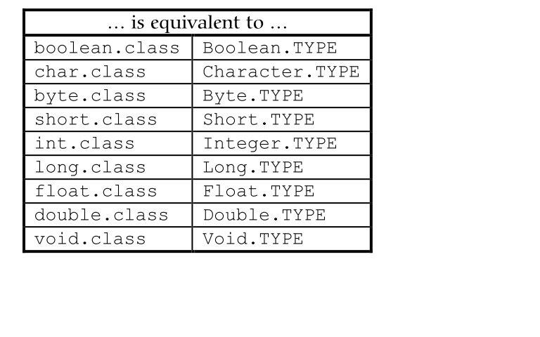

Run-Time Type Information
======
## Outline

- [前言](#前言)
- [傳統的RTTI機制](#傳統的RTTI機制)
	+ [向上轉型或向下轉型](#向上轉型或向下轉型)
	+ [Class 物件](#Class 物件)
	+ [使用instanceof](#使用instanceof)
- [Reflection機制](#Reflection機制)
	+ [RTTI機制與Reflection機制差異](#RTTI機制與Reflection機制差異)
- [參考文獻](#參考文獻)

## 前言
執行期型別資訊(Run-Time Type Information, RTTI)機制，
讓你得以在程式執行期間找出、並使用型別資訊。

包含兩種機制：
- [傳統的RTTI機制](#傳統的RTTI機制)，他假設你在編譯期和執行期擁有所有型別資訊。
- [Reflection機制](#Reflection機制)，允許你在執行期間找出和class相關的資訊。

## 傳統的RTTI機制

###向上轉型或向下轉型
這是RTTI最基本的形式，所有轉型動作都會於執行期檢查正確性。
向上轉型(Upcasting)是安全的，
但向下轉型(Downcasting)卻是有風險的，編譯器不會讓你向下轉型至實際上不是該型別之subclass的型別，
轉型錯誤時會擲出ClassCastException。

```java
import java.lang.reflect.Array;
import java.util.*;

abstract class Shape {
  void draw() {
    System.out.println(this + ".draw()");
  } // draw()
  
  abstract public String toString() ;
}

class Circle extends Shape {
  public String toString() { return "Circle"; }
}

class Square extends Shape {
  public String toString() { return "Square"; }
}

class Triangle extends Shape {
  public String toString() { return "Triangle"; }
}

public class DemoPolymorphismAndUpcasting {
	  public static void main(String[] args) {
		    ArrayList s = new ArrayList();
		    s.add(new Circle());
		    s.add(new Square());
		    s.add(new Triangle());
		    Iterator e = s.iterator();
		    while(e.hasNext())
		      ((Shape)e.next()).draw();
		  }
}
```

### Class 物件
Class物件內包含與class相關的各種資訊。每當你撰寫新的class並編譯完成，
就會產生一個Class物件儲存於相同的.class檔內。
為了妥善使用有限的資源，Java 在真正需要使用到 class 的時候才會將其載入，
而載入 Class 的工作是由 Class Loader(類別載入器) 所負責。
當每一個 class 被載入時，JVM 就會為其自動產生一個 Class object。

每一個 object 都可以透過 getClass() 的方式取得 Class object，以下為一個簡單的範例：

```java

public class DemogetClass {

	public static void main(String[] args) {
	       String name = "godleon";
	       Class stringClass = name.getClass();

	       System.out.println("類別名稱：" + stringClass.getName());
	       System.out.println("是否為介面：" + stringClass.isInterface());
	       System.out.println("是否為基本型態：" + stringClass.isPrimitive());
	       System.out.println("是否為陣列物件：" + stringClass.isArray());
	       System.out.println("父類別名稱：" + stringClass.getSuperclass().getName());
	}

}

```
Java允許我們從多種管道為一個class生成對應的Class object。整理如下圖：





而 Java 只有在真正要用到 class 的時候才會將其載入，而真正用到的時候是指以下情況：
- 使用 class 生成 object 時
- 使用者指定要載入 class (利用 Class.forName() 或是 ClassLoader.loadClass())

若僅是宣告並不會載入 class，以下用一段程式碼來測試：
```java

class TestClass {
   static {
       System.out.println("類別被載入");
   }
}

public class DemoLoadClass {
	   public static void main(String args[]) {
	       TestClass test = null;  //class不會載入，因此不會顯示「類別被載入」
	       System.out.println("宣告 TestClass 參考名稱");
	       test = new TestClass(); //class被載入，顯示「類別被載入」
	       System.out.println("生成 TestClass 實例");
	   }
}

```

此外，由於 Java 支援 Run-Time Type Identification(RTTI，執行時期型別辨識)，因此 Class 的訊息在編譯時期就會被加入 .class 檔案中；
而執行時，JVM 則會在使用某 class 時，會先檢查相對應的 Class object 是否已經載入，如果沒有載入，則會尋找相對應的 .class 檔案載入。
而一個 class 在 JVM 中只會有一個 Class object，所以每個 object 都可以透過 getClass() 或是 .class 屬性取得 Class object。
之前有說過，在 Java 中任何東西皆為 object，因此 Array 也不例外，甚至如 primitive type、關鍵字 void 都有相對應的 Class object，以下用一段程式來說明：
```java

class Candy {
  static {
    System.out.println("Loading Candy");
  }
}

class Gum {
  static {
    System.out.println("Loading Gum");
  }
}

class Cookie {
  static {
    System.out.println("Loading Cookie");
  }
}

public class DemoClassLoaderWorks {

	  public static void main(String[] args) {
		    System.out.println("inside main");
		    new Candy();
		    System.out.println("After creating Candy");
		    try {
		      Class.forName("Gum");
		    } catch(ClassNotFoundException e) {
		      e.printStackTrace(System.err);
		    }
		    System.out.println(
		      "After Class.forName(\"Gum\")");
		    new Cookie();
		    System.out.println("After creating Cookie");
		  }

}

```

上面的程式使用了forName()這個方法來取得Class object reference，他接受一個
字串作為引數，字串內含有某個『你想取其Class物件』的reference的文字表示式。
如果class還沒備載入過，forName()函式內則會執行載入的動作，而在載入過程中會執行class內的static子句。


### 使用instanceof
Java還有第三種RTTI形式，那就是關鍵字instanceof，
他能夠告訴你某個物件是否為某特定型別的一個實體(instance)。
他會回傳一個boolean值，所以你可以採用問句型式運用之，例如：

```
if ( x instanceof Dog )
	((Dog) x).bark() ;
```

上述if述句會在x被轉型為Dog之前先檢查物件x是否屬於class Dog。
當你手上沒有其他資訊可以告訴你物件型別時，在向下轉型之前先運用instanceof進行檢查，是很重要的一件事
否則你可能會收到ClassCastException。

查詢型別資訊時，如果你運用instanceof(或isInstance())，情況和『直接比較Class物件』有個重大差異：

```java
class Base {}
class Derived extends Base {}

public class FamilyVsExactType {
  static void test(Object x) {
    System.out.println("Testing x of type " +
      x.getClass());
    System.out.println("x instanceof Base " +
      (x instanceof Base));
    System.out.println("x instanceof Derived " +
      (x instanceof Derived));
    System.out.println("Base.isInstance(x) " +
      Base.class.isInstance(x));
    System.out.println("Derived.isInstance(x) " +
      Derived.class.isInstance(x));
    System.out.println(
      "x.getClass() == Base.class " +
      (x.getClass() == Base.class));
    System.out.println(
      "x.getClass() == Derived.class " +
      (x.getClass() == Derived.class));
    System.out.println(
      "x.getClass().equals(Base.class)) " +
      (x.getClass().equals(Base.class)));
    System.out.println(
      "x.getClass().equals(Derived.class)) " +
      (x.getClass().equals(Derived.class)));
  }
  public static void main(String[] args) {
    test(new Base());
    test(new Derived());
  }
} ///:~
```

上例中instanceof所表現的意義是『你就是這個Class嗎?或是其derived class?』
但如果是用== 比較兩個Class物件，那就不理會繼承關係，其意義是『正好就是這個型別嗎?』


## Reflection機制
Reflection在Java指的是我們可以於執行期載入、探知、使用編譯期間完全未知的classes。
換句話說，Java程式可以載入一個執行期才得知名稱的class，
獲悉其完整構造（但不包括 methods定義），並生成其物件實體、或對其 fields 設值、或喚起其 methods。
。這種「看透 class」的能力（the ability of the program to examine itself）被稱為 introspection(內省)。

以下為一些簡單範例：

Example1 : Get class name from object
```java
import java.lang.reflect.Method;
 
class Foo {
	public void print() {
		System.out.println("abc");
	}
}

public class DemoGetClassName {

	public static void main(String[] args){
		Foo f = new Foo();
		System.out.println(f.getClass().getName());		
	}
}
```

Example 2: Invoke method on unknown object

若有一個未知的object，使用reflection可以使用這個object，
並找它裡面是否有一個叫做"print"的方法，然後使用它。

```java
import java.lang.reflect.Method;
 
class Qoo {
	public void print() {
		System.out.println("abc");
	}
}

public class DemoUnknownObjectMethod {
	public static void main(String[] args){
		Qoo f = new Qoo();
 
		Method method;
		try {
			method = f.getClass().getMethod("print", new Class<?>[0]);
			method.invoke(f);
		} catch (Exception e) {
			e.printStackTrace();
		}			
	}

}
```

Example 3: Create object from Class instance

```java
public class DemoforName {

	public static void main(String[] args){
		//create instance of "Class"
		Class<?> c = null;
		try{
			c=Class.forName("Foo");
		}catch(Exception e){
			e.printStackTrace();
		}
 
		//create instance of "Foo"
		Foo f = null;
 
		try {
			f = (Foo) c.newInstance();
		} catch (Exception e) {
			e.printStackTrace();
		}	
 
		f.print();
	}

}

```

Example 4: Change array size though reflection

```java
import java.lang.reflect.Array;

public class DemoChangeArraySize {

	public static void main(String[] args) {
		int[] intArray = { 1, 2, 3, 4, 5 };
		int[] newIntArray = (int[]) changeArraySize(intArray, 10);
		print(newIntArray);
 
		String[] atr = { "a", "b", "c", "d", "e" };
		String[] str1 = (String[]) changeArraySize(atr, 10);
		print(str1);
	}
 
	// change array size
	public static Object changeArraySize(Object obj, int len) {
		Class<?> arr = obj.getClass().getComponentType();
		Object newArray = Array.newInstance(arr, len);
 
		//do array copy
		int co = Array.getLength(obj);
		System.arraycopy(obj, 0, newArray, 0, co);
		return newArray;
	}
 
	// print
	public static void print(Object obj) {
		Class<?> c = obj.getClass();
		if (!c.isArray()) {
			return;
		}
 
		System.out.println("\nArray length: " + Array.getLength(obj));
 
		for (int i = 0; i < Array.getLength(obj); i++) {
			System.out.print(Array.get(obj, i) + " ");
		}
	}
}

```


### RTTI機制與Reflection機制差異
- 使用RTTI時，編譯器在編譯期即開啟並檢查.class檔，換句話說你可以採用一般方式呼叫物件的所有函式。
- 但如果採用reflection機制，編譯期並不會取用.class檔，他會由執行環境加以開啟和檢驗。


## 參考文獻

- [Java 學習筆記 (10) - Reflection](http://godleon.blogspot.tw/2007/09/class-class-java-class-class-jvm-class.html)
- [Java Reflection](http://jjhou.boolan.com/javatwo-2004-reflection.pdf)
- [Java RTTI and Reflection](http://www.cnblogs.com/fxjwind/p/3430178.html)
- [Java with RTTI](http://noveltypioneer.blogspot.tw/2014/05/java-with-rtti.html)


